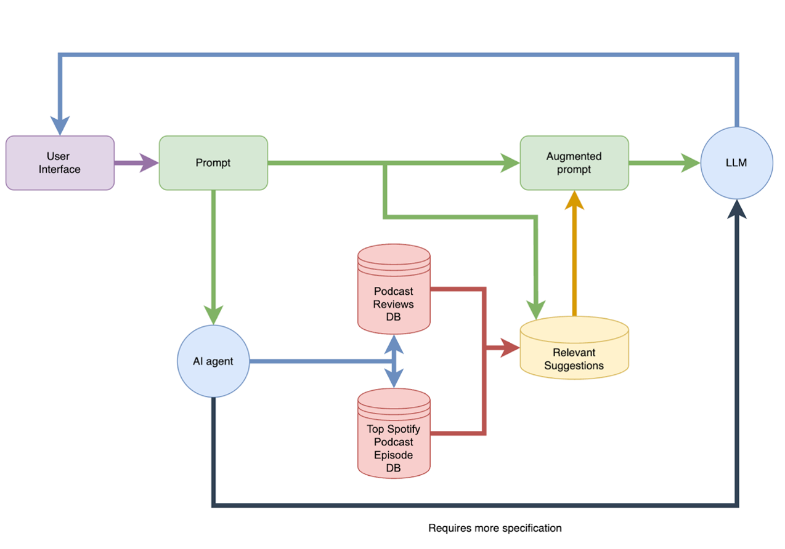

# <p style="text-align:center;">THE PODCAST EXPERIENCE</p>


**<p style="text-align:center;">The noval AI assistant for podcast recommendations.</p>**

<p style="text-align:center;">A RAG AI agent which the user can ask for podcast recommendations. The AI agent will extract podcast shows or specific episodes, from a collected database, based on user request while taking into account his needs such as limited available time.</p>

## How Does It Work? - Our Pipeline



Our pipeline contains 7 steps:

1. **Receiving User Prompt**
As soon as we receive the user's prompt, we perform an initial check. We verify whether the prompt contains enough information for an effective podcast search. Additionally, we check for any sensitive content that violates the API's safety policies. If the prompt is valid, we proceed to the next step; otherwise, the user receives an appropriate message.

2. **Extract Search Filters**
In the second step, we extract key information from the prompt to refine and improve our podcast search within the vector database. This includes determining relevant filters such as whether to search within episodes or shows, the number of recommendations to provide, and preferred episode durations.

3. **Understanding A Users Needs**
We summarize the user's prompt into a concise sentence that captures key keywords and essential details. This summary is then used to optimize the search query for an Approximate Nearest Neighbor (ANN) search within our podcast or episode embedding model.

4. **Extracting Relevant Podcast Shows And Episodes**
The summarized user needs from the previous step are converted into a vector embedding, which is then used to find similar podcasts in our vector database. This search also considers the filters established in step 2 to ensure more relevant results.

5. **Selecting The Best Shows/Episodes**
We generate an augmented prompt that combines the data collected in the previous step with additional details, including the number of recommendations, the user's original prompt, and the summarized user needs from step 3. This enriched prompt is then passed to another agent, which selects the most relevant results based on their descriptions and other metadata.

6. **Creating An Answer To The User**
In this step, we take all the carefully selected data from the previous steps and generate a well-structured and engaging response for the user. The response includes the suggested shows or episodes, along with their URLs and episode durations (if requested by the user), ensuring a personalized and informative recommendation.

7. **Supervision**
Finally, an AI agent verifies that the response accurately aligns with the original prompt. It refines and finalizes the recommendations, ensuring they are relevant, well-structured, and appropriately tailored to the user's request.

## Our Data 

For this agent we have collected to databases:

1. *Top Spotify Podcast Episodes [^1]:* A dataset which contains daily snapshot of Spotify's top 200 podcast episodes. It also includes detailed information about podcast episodes and shows from Spotify API.
From this dataset we extracted data on podcast episodes which included their name, description, show name, their duration and a link to the show and episode itself

2. *Podcast Reviews [^2]:* A dataset which 2 million podcast reviews for 100k podcasts, updated monthly. From this dataset we extracted data on podcast shows which includes their name, description, average rating and link to the show itself

[^1]: [Episodes dataset](https://www.kaggle.com/datasets/daniilmiheev/top-spotify-podcasts-daily-updated/data)

[^2]: [Shows dataset](https://www.kaggle.com/datasets/thoughtvector/podcastreviews)

Our data is stored in **Pinecone's vector database** which is a high-performance vector database optimized for Approximate Nearest Neighbor (ANN) search. It enables fast and scalable similarity searches on high-dimensional embeddings, making it ideal for applications such as: AI-powered search, Recommendation systems, Natural language processing (NLP) models.
Which made it perfect for our needs. 
We've created an index in our dataset that stores the embedding vector for each show or episode, along with additional metadata such as duration and the source dataset. This enables us to perform selective searches, allowing us to filter for specific data based on certain attributes—such as searching only for podcast episodes, rather than the entire dataset.

## How To Run Our Code:

**Requirements:** 
* Our code was built and tested on python3.11, which makes it the preferable version (However it might work on others, but will require changing package versions)
* Must have a `.env` file which should be added to the projects directory. Note that some frameworks might require additional steps to read the `.env` file, if you encounter any issues you can hard code the API key in the `llms.py` file under the `AZURE_OPENAI_API_KEY` variable.
* The contains of this file should be the `Azure OpenAI api key` and it should be written as such:
```.env
API_KEY="your-secret-api-key"
```

**Instructions:**

1. Clone the repository using git clone:
```bash
git clone https://github.com/avishagnevo/agentic-RAG.git
```

2. Enter the directory of the project:
```bash
cd agentic-RAG/
```

3. Create a python environment:
```bash
python3.11 -m venv podcast_env
```

4. Source the environment:
    - if using linux/macOS:
    ```bash
    source podcast_env/bin/activate
    ```
    - if using Windows:
    ```bash
    podcast_env\Scripts\activate
    ```

5. Install the requirements:
```bash
pip install -r requirements.txt
```

6. Run the code:
```bash
python3.11 pipeline.py
```

## Examples:
Our repository provides 4 different examples of our agent in the folder `examples/`.
Inside the folder there are 4 sub-folders, one for each example.
In each subfolder there are three files:
1. a `example1.txt` file: This file is a simple text file which holds the user's prompt and the output of the agent for that prompt
2. a `example1.bash` file: This file allows you to run the current example. To run the example you must complete steps 1 - 4 in [How To Run Our Code](#how-to-run-our-code:), then you can run:
```bash
bash examples/example{i}/example{i}.bash    # {i} should be replaced with the number of example you want to run
```
3. a `example1.zsh` file: Same as the `.bash` file, but for those that use `zsh` instead of `bash`. To run the example you must complete steps 1 - 4 in [How To Run Our Code](#how-to-run-our-code:), then you can run:
```zsh
./examples/example{i}/example{i}.bash    # {i} should be replaced with the number of example you want to run
```

**note:** This works on macOS/linux systems, to run the examples on Windows you should use WSL.

## Repository Structure:

```perl
agentic-RAG/
├── agent_templates.json        # A json file containing prompt templates for our agents in the project.
├── agent.py                    # An agent class that performs micro tasks.
├── database.py                 # Handles all operations related to dataset management.
├── llms.py                     # Handles all interactions with the Azure OpenAI API.
├── pipeline.py                 # The main python file which holds the pipeline of our agent.
├── episode_preprocessing.py    # A preprocessing file for the episode database.
├── podcasts_preprocessing.py   # A preprocessing file for the show database.
├── utils.py                    # utility functions
├── examples/                   # The folder with our examples
│   ├── example1/
│   │   ├── example1.txt
│   │   ├── example1.bash
│   │   └── example1.zsh
│   ├── example2/
│   │   ├── example2.txt
│   │   ├── example2.bash
│   │   └── example2.zsh
│   └── example3/
│       ├── example3.txt
│       ├── example3.bash
│       └── example3.zsh
└── requirements.txt            # Project dependencies
```
